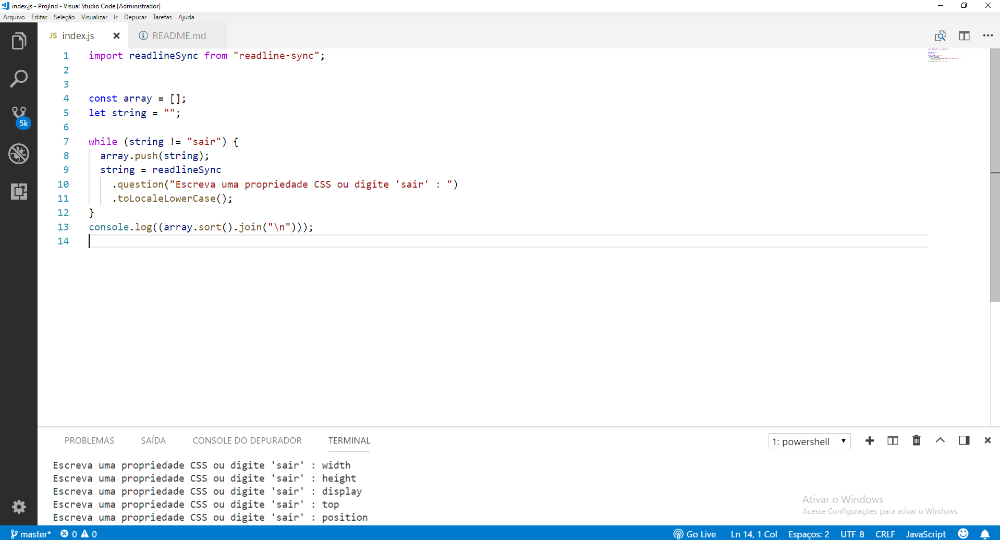
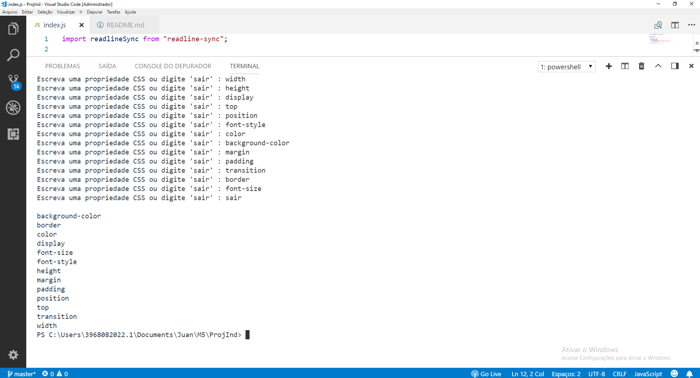

# Projeto Individual - Modulo 5 - Programadores Cariocas

Proposta do projeto: Montar um código (Node.js) que receberá uma lista de
propriedades de CSS (ex: background-color, font-size, text-align) e vai devolver
essa lista ordenada de A-Z até o usuario digitar a palavra 'sair'.

O código:

A saída no console:

